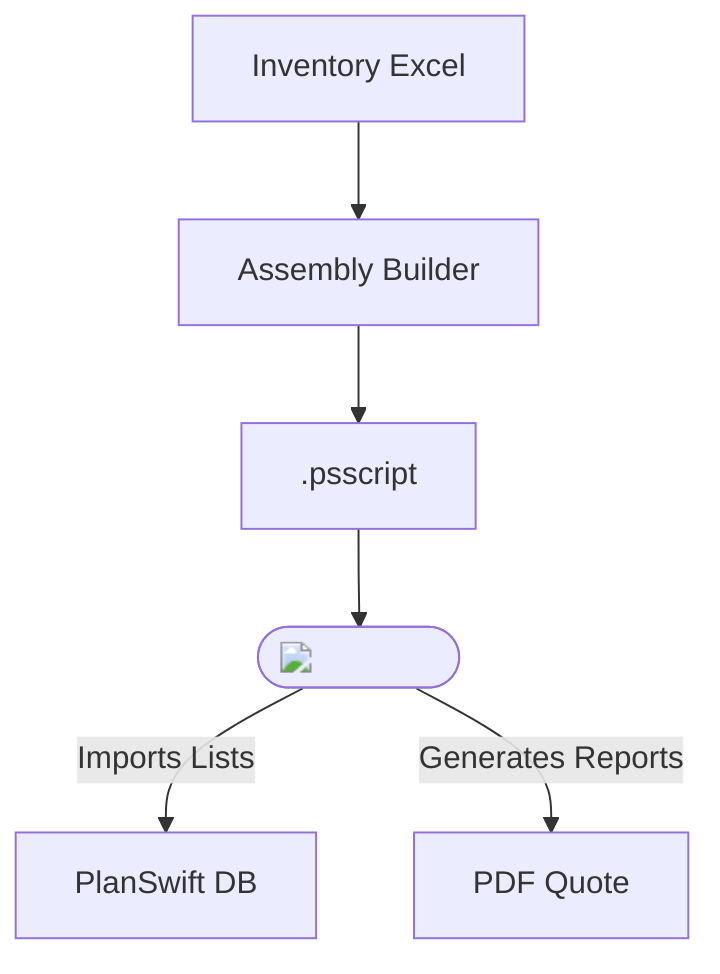

<!-- docs/explanation/architecture.md -->
# Architecture Overview

Assembly Builder: stateless; reads Excel, writes script.

Plugin: static bundle; ships lists & layouts.

PlanSwift: runtime environment + reporting.

yaml
Copy
Edit

---