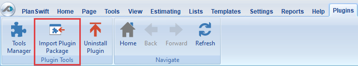
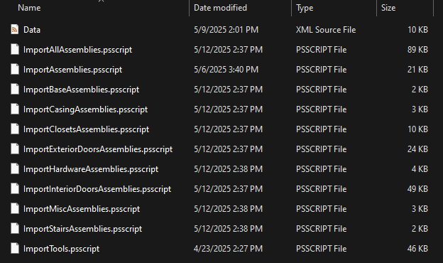
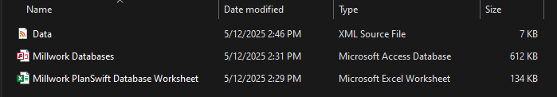

<!-- docs/getting-started/installation.md -->
# Installation & First-time Setup

!!! info "Important"
    Users should be using the BFS version of PlanSwift 10.2  
    Both tools have been tested on Windows only  

## 1. Download installers

| File | Link |
|------|------|
| `Millwork PlanSwift Plugin 2.0.0.zip` | *(internal portal)* |
| `Millwork Assembly builder 1.0.0.zip` | *(internal portal)* |

## 2. Import the Plugin

1. Extract contents from the downloaded zip file.
2. Open PlanSwift → *Plugins* ▸ **Import Plugin Package**.  
3. Select `Millwork Plugin Package 2.0.0`  
4. Restart PlanSwift when prompted – you should now see **Millwork** plugins in Estimating ribbon.

{ width="350" .center }

## 3. Install Assembly Builder

1. Simply extract the executable file from the downloaded zip file.

## 4. Verify

* `C:\Program Files (x86)\PlanSwift10\Data\Plugins\Create Tools` contains several **PSSCRIPT** type files.  

{ width="350" .center }

* `C:\Program Files (x86)\PlanSwift10\Data\Plugins\Millwork Databases` contains the Millwork **Microsoft Excel Worksheet** and **Microsoft Access Database** files.  

{ width="350" .center }

Next: [Quick-start ▸ Plugin](quick-start-plugin-package.md).
