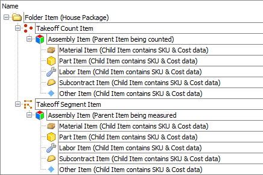

<!-- docs/getting-started/quick-start-plugin.md -->
# Quick-start · Plugin Package

**Goal:**  
Complete a millwork takeoff that pulls inventory costs from the included list databases to generate an accurate quote.

## Step 1: Create A New Job

=== "Demo"
    { width="350" .center }

=== "Flowchart"
    ``` mermaid
    flowchart TD
      A[PlanSwift ▸ New Job] --> B[Name Your Job];
      B --> C[Set Your Margins];
      C --> D[Select Your Floor Plan Image Files];
      D -->E[Finish];
    ```

## Step 2: Complete Your Takeoff

=== "Demo"
    { width="350" .center }

=== "Flowchart"
    ``` mermaid
    flowchart TD
      A[Create Takeoff Item] --> B[Name Takeoff Item];
      B -- Optional --> C[Create & Name The Folder];
      C --> D;
      B --> D[Count/Measure With Takeoff Item];
      D --> E[Drag & Drop Prebuilt Millwork Template Assembly Items Onto Takeoff];
      E --> F[Set Qty Per Count Property];
      F --> G[View In Estimating Tab];
      G --> H[Use Custom Layouts To Display Data];
    ```

## Step 3: Adjust Margins & Generate Reports

=== "Demo"
    { width="350" .center }

=== "Flowchart"
    ``` mermaid
    flowchart TD
      A[Adjust Margins] -- Use Plugin --> B[Select Margin To Adjust];
      A -- Use Job Property Form --> C[PlanSwift Logo ▸ Job Properties];
      
      C --> I[Set Margin Percentage Values];
      I --> J[Click OK];
      J --> F;

      B --> D[Set Percentage Value];
      D --> E[Click Refresh To Update Pricing];
      E --> F[Use Custom Reports To Generate A Quote];
    ```

!!! info "Very Important"
    <center>
    This is the proper way to structure PlanSwift Parent/Child Items so that data is properly displayed on PlanSwift Reports.  
    For more details about individual items please see ▸ [Field Definitions](../reference/field-definitions/job.md)
    </center>

    === "PlanSwift Screenshot"
        { width="350" .center }
    
    === "Text Tree"
        Folder  
        └─ Segment (For measuring linear feet)  
        &nbsp;|&nbsp; &nbsp; &nbsp;└─ Assembly (Container of items) Ex. door, trim, closet, etc.  
        &nbsp;|&nbsp; &nbsp; &nbsp; &nbsp; &nbsp; &nbsp;├─ Material (Inventory items with SKU & Cost data)  
        &nbsp;|&nbsp; &nbsp; &nbsp; &nbsp; &nbsp; &nbsp;├─ Part (Same as Material items)  
        &nbsp;|&nbsp; &nbsp; &nbsp; &nbsp; &nbsp; &nbsp;├─ Labor (Inhouse manufacturing labor)  
        &nbsp;|&nbsp; &nbsp; &nbsp; &nbsp; &nbsp; &nbsp;├─ Subcontract (Install labor)  
        &nbsp;|&nbsp; &nbsp; &nbsp; &nbsp; &nbsp; &nbsp;└─ Other (Option items)  
        └─ Count (For counting qty)  
        &nbsp; &nbsp; &nbsp;└─ Assembly (Container of items) Ex. door, trim, closet, etc.  
        &nbsp; &nbsp; &nbsp; &nbsp; &nbsp; &nbsp;├─ Material (Inventory items with SKU & Cost data)  
        &nbsp; &nbsp; &nbsp; &nbsp; &nbsp; &nbsp;├─ Part (Same as Material items)  
        &nbsp; &nbsp; &nbsp; &nbsp; &nbsp; &nbsp;├─ Labor (Inhouse manufacturing labor)  
        &nbsp; &nbsp; &nbsp; &nbsp; &nbsp; &nbsp;├─ Subcontract (Install labor)  
        &nbsp; &nbsp; &nbsp; &nbsp; &nbsp; &nbsp;└─ Other (Option items)  