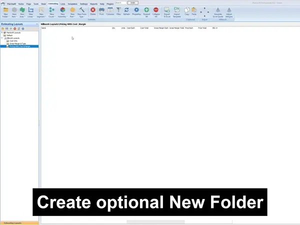
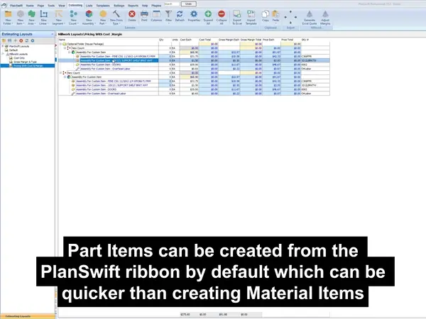
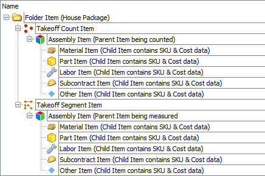

<!-- docs/how-to/create-custom-item.md -->

## Use-case

You need an Assembly that is not included in the prebuilt Millwork Template.

=== "Demo"
    { width="350" .center }

=== "Flowchart"
    ``` mermaid
    flowchart TD
      A[Create & Name Folder] --> B[Create & Name Assembly Item];
      B --> C[Set Qty Per Count];
      C --> D["Add Child Item (Material, Part or Labor) to Assembly Item"];
      D -- Optional --> E[Use Helpful Name Formula];
      D --> F;
      E --> F[Search & Select SKU Inventory Item From Selected Item Dropdown];
      F --> G[Confirm Parent/Child Assembly Structure];
      G -- Optional --> H[Drag & Drop Assembly Into Template For Later Use];
    ```

## Materials VS Parts
<center>
It is important to understand that certain PlanSwift Reports will separate Part and Material data. This can ultimately affect how quotes are generated via PlanSwift Reports.
</center>
{ width="350" .center }

---

!!! info "Very Important"
    <center>
    This is the proper way to structure PlanSwift Parent/Child Items so that data is properly displayed on PlanSwift Reports.  
    For more details about individual items please see ▸ [Field Definitions](../reference/field-definitions/job.md)
    </center>

    === "PlanSwift Screenshot"
        { width="350" .center }
    
    === "Text Tree"
        Folder  
        └─ Segment (For measuring linear feet)  
        &nbsp;|&nbsp; &nbsp; &nbsp;└─ Assembly (Container of items) Ex. door, trim, closet, etc.  
        &nbsp;|&nbsp; &nbsp; &nbsp; &nbsp; &nbsp; &nbsp;├─ Material (Inventory items with SKU & Cost data)  
        &nbsp;|&nbsp; &nbsp; &nbsp; &nbsp; &nbsp; &nbsp;├─ Part (Same as Material items)  
        &nbsp;|&nbsp; &nbsp; &nbsp; &nbsp; &nbsp; &nbsp;├─ Labor (Inhouse manufacturing labor)  
        &nbsp;|&nbsp; &nbsp; &nbsp; &nbsp; &nbsp; &nbsp;├─ Subcontract (Install labor)  
        &nbsp;|&nbsp; &nbsp; &nbsp; &nbsp; &nbsp; &nbsp;└─ Other (Option items)  
        └─ Count (For counting qty)  
        &nbsp; &nbsp; &nbsp;└─ Assembly (Container of items) Ex. door, trim, closet, etc.  
        &nbsp; &nbsp; &nbsp; &nbsp; &nbsp; &nbsp;├─ Material (Inventory items with SKU & Cost data)  
        &nbsp; &nbsp; &nbsp; &nbsp; &nbsp; &nbsp;├─ Part (Same as Material items)  
        &nbsp; &nbsp; &nbsp; &nbsp; &nbsp; &nbsp;├─ Labor (Inhouse manufacturing labor)  
        &nbsp; &nbsp; &nbsp; &nbsp; &nbsp; &nbsp;├─ Subcontract (Install labor)  
        &nbsp; &nbsp; &nbsp; &nbsp; &nbsp; &nbsp;└─ Other (Option items)  

You’re done!  

Ready for automation? Head to [Quick-start • Assembly Builder](quick-start-assembly-builder.md).